# AI-Enhanced CRM & Ticket Management System

## 1. Cover Page

**Project Title:** AI-Enhanced CRM & Ticket Management System  
**Course:** Artificial Intelligence  
**Assignment Type:** Major Project Assignment  
**Team Members:** [Fill in names and student IDs here]  
**Submission Date:** [Fill in date]  
**Institution/Class:** [Fill in if required]  

---

## 2. Project Overview

The **AI-Enhanced CRM & Ticket Management System** is a minimum viable product developed for
TechServe Solutions. It centralizes customer records and support-ticket workflows in a single web
application. The system replaces fragmented manual tracking with a structured workspace where
support agents can manage their assigned work and managers can monitor the complete service
operation.

The core business problem is straightforward: support requests are difficult to manage when
customer details, issue descriptions, ownership, progress updates, and resolution records are kept
in separate places. Manual processes increase the risk of missed tickets, duplicated effort, slow
responses, and poor visibility for decision-makers. TechServe Solutions needs one system that makes
the current state of support work visible and traceable.

The implemented MVP addresses this problem with two operational roles:

- **Manager:** can view all customers and tickets, assign agents, delete records, inspect reports,
  review notification history, and send test notifications.
- **Agent:** can create customers and tickets, view assigned records, add ticket comments, update
  assigned tickets, use AI assistance, and review scoped dashboard information.

The application includes customer management, ticket management, internal notes, timestamps,
activity history, dashboard analytics, manager reports, artificial-intelligence assistance, and SMTP
email notifications. AI features help classify tickets, identify customer sentiment, draft reply
suggestions, and summarize support records. SMTP messaging makes important ticket events available
outside the application through email.

The result is a compact but complete support-management system that demonstrates practical AI
integration inside an ordinary business workflow. AI is not presented as a separate experiment. It
is embedded where an agent or manager needs it: during ticket intake, issue review, response
preparation, escalation, and resolution.

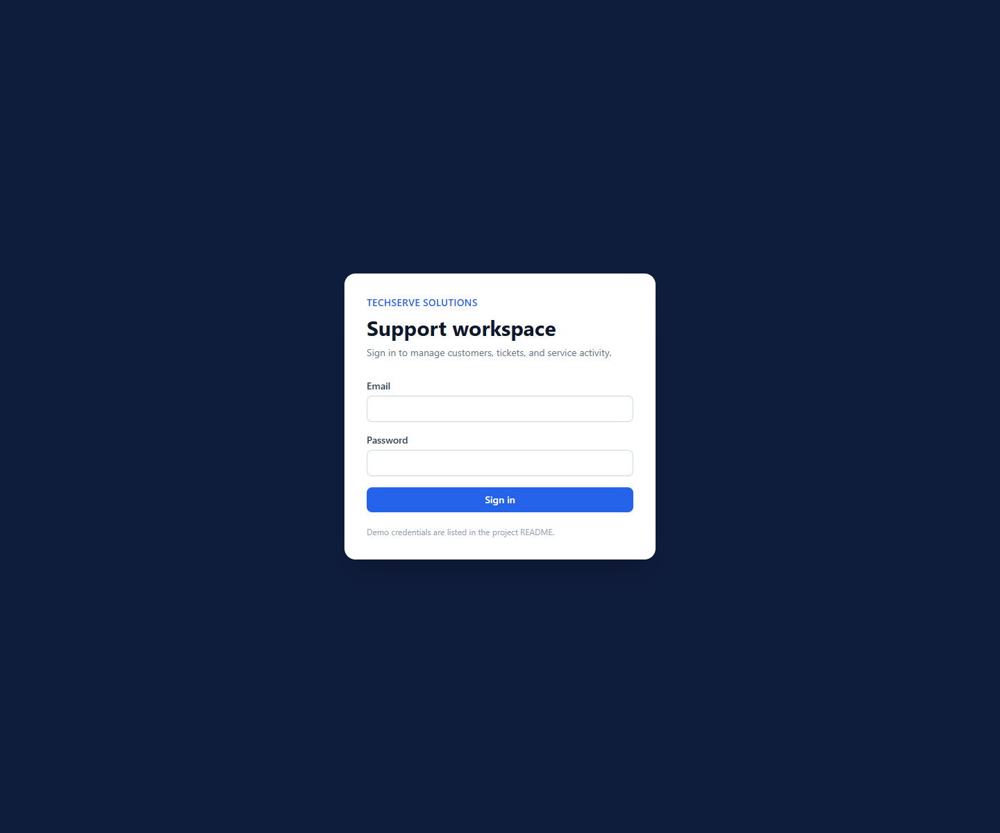

*Figure 1. Login page for the TechServe support workspace.*

## 3. System Architecture

The application uses a layered web architecture. The frontend is responsible for user interaction,
the backend exposes protected REST endpoints, the database stores persistent CRM records, the AI
service generates ticket assistance, and the messaging service attempts SMTP email delivery.

### Frontend Layer

The user interface is built with **React**, **Vite**, and **Tailwind CSS**. React Router controls
navigation between Login, Dashboard, Customers, Tickets, and Reports pages. An authentication
context stores the current user and access token in local storage. An Axios client automatically
adds the JWT bearer token to API requests and clears local authentication state when the backend
returns an unauthorized response.

### Backend Layer

The backend is a **FastAPI** REST API. Route modules separate authentication, customers, tickets,
dashboard statistics, reports, and notifications. Pydantic schemas validate incoming payloads and
serialize API responses. Reusable dependencies enforce authentication and permissions on the server,
which means security does not depend only on hidden frontend links.

### Database Layer

The application uses **SQLite** for persistent storage and **SQLAlchemy ORM** for models,
relationships, and transactions. SQLite is appropriate for this assignment MVP because it is easy
to initialize locally while preserving data across server restarts. The same ORM-based architecture
could later be adapted to a production relational database.

### Authentication And Authorization

Login uses **JWT access tokens** signed with a secret loaded from the environment. Passwords are
stored as Argon2 hashes, never as plaintext database values. Backend dependencies verify tokens and
enforce Manager or Agent access rules. The frontend provides a matching user experience by hiding
manager-only navigation for Agent accounts.

### AI And Messaging Services

The AI module provides a local rule-based fallback plus optional OpenAI and Gemini adapters. The
messaging module uses Python's standard-library SMTP tools to format and send email. Delivery
attempts are persisted so ticket work remains traceable even when external email configuration is
unavailable or authentication fails.

### Text-Based Architecture Diagram

```text
User Browser -> React Frontend -> FastAPI Backend -> SQLAlchemy ORM -> SQLite Database
                                      |
                                      +-> AI Service
                                      |    +-> Rule-Based Fallback
                                      |    +-> Optional OpenAI / Gemini Provider
                                      |
                                      +-> SMTP Email Service -> Recipient Inbox
```

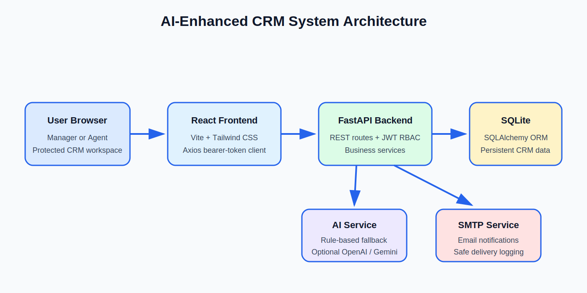

*Figure 2. High-level architecture of the AI-enhanced CRM system.*

## 4. Database Schema

The database schema is designed around a ticket-centric CRM workflow. Customer profiles and users
provide context and ownership, while comments, activity records, and notifications preserve the
history of each support request.

### Users / Agents

The `users` table stores authenticated staff accounts. Important fields include:

- `id`: primary key
- `name`: display name
- `email`: unique login identifier
- `password_hash`: secure hashed password
- `role`: either `manager` or `agent`
- `is_active`: controls account availability
- `created_at`: account creation timestamp

One Agent user can be assigned many customers and many tickets. Managers are users with broader
permissions rather than a separate database entity.

### Customers

The `customers` table stores CRM profile information:

- `id`: primary key
- `full_name`, `email`, `phone`, `company`: customer contact data
- `notes`: contextual CRM notes
- `assigned_agent_id`: optional foreign key to `users.id`
- `created_at`: profile creation timestamp

One customer can have many support tickets. This allows a customer detail page to show contact
information and ticket history together.

### Tickets

The `tickets` table is the central operational entity:

- `id`: primary key
- `title`, `description`: support request content
- `status`: Open, In Progress, Resolved, or Closed
- `priority`: Low, Medium, High, or Critical
- `category`: business-facing category
- `customer_id`: foreign key to the customer
- `assigned_agent_id`: optional foreign key to the responsible Agent
- `created_at`, `updated_at`, `resolved_at`: lifecycle timestamps
- `ai_category`, `ai_sentiment`, `ai_summary`: stored AI outputs

### Ticket Comments

The `ticket_comments` table stores chronological support updates and internal notes:

- `id`: primary key
- `ticket_id`: foreign key to the ticket
- `agent_id`: foreign key to the user who added the update
- `message`: update text
- `is_internal`: marks internal support notes
- `created_at`: comment timestamp

### Ticket Activity

The `ticket_activities` table is an audit trail:

- `id`: primary key
- `ticket_id`: foreign key to the ticket
- `actor_id`: foreign key to the acting user
- `action`: action description
- `old_value`, `new_value`: changed values when applicable
- `created_at`: action timestamp

It records ticket creation, comments, status changes, priority changes, resolution, AI analysis, and
summary refresh actions.

### Notification Logs

The `notification_logs` table persists messaging attempts:

- `id`: primary key
- `ticket_id`: foreign key to the ticket
- `platform`: currently `smtp`
- `message`: stored email subject and body
- `status`: `logged`, `sent`, `skipped`, or `failed`
- `sent_at`: attempt timestamp

### Relationships

- One user/agent can be assigned many customers.
- One user/agent can be assigned many tickets.
- One customer can have many tickets.
- One ticket can have many comments.
- One ticket can have many activity records.
- One ticket can have many notification logs.

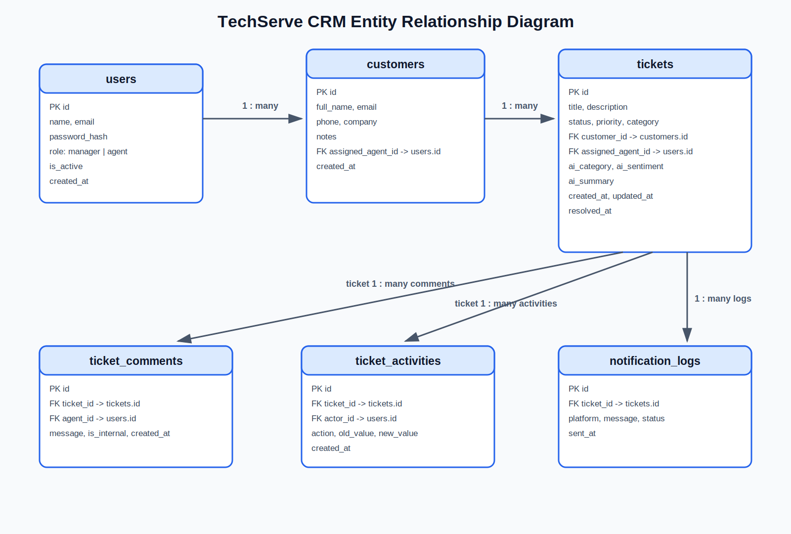

*Figure 3. Main entities and relationships in the SQLite database.*

## 5. AI Integration

The AI service improves ticket handling while keeping the application usable without paid API
credentials. It supports five practical functions.

### Auto Ticket Categorization

When a ticket is created, the system analyzes the title and description and assigns a category such
as Account, Technical, Billing, Refund, Shipping, or General. This improves organization and makes
dashboard and report statistics more useful.

### Sentiment Analysis

The same ticket content is analyzed for sentiment. Supported labels include Positive, Neutral,
Negative, and Frustrated. A visibly frustrated request helps the support team identify work that may
need quicker attention.

### Escalation Recommendation

The application recommends escalation when a frustrated ticket still has Low or Medium priority.
This gives the Agent or Manager a prompt to review priority before the issue is overlooked.

### AI Reply Suggestion

From the ticket detail page, a user can generate a professional draft response. The suggested reply
acknowledges the customer's issue, states that the support team is reviewing it, and avoids inventing
a resolution. The draft can be copied into the comment box for editing.

### AI Resolution Summary

When a ticket becomes Resolved, the system creates a concise internal summary. A user can also
refresh the summary manually. The summary captures issue context, category, current status, and
logged updates.

### Trigger Points And Provider Strategy

AI runs during ticket creation, manual ticket analysis, reply generation, ticket resolution, and
manual summary refresh. Outputs are saved where appropriate and shown directly in the ticket-detail
interface.

The default `rule_based` provider works locally without API keys. Optional OpenAI and Gemini
providers can be enabled through environment variables. If a hosted provider is unavailable, lacks
credentials, or returns an error, the local fallback produces a useful result instead of breaking
the ticket workflow.

### Example Input And Output

**Example ticket**

```text
Title: Cannot login to my account
Description: I am very frustrated. I reset my password but nothing works.
```

**Example AI output**

```text
Category: Account or Technical
Sentiment: Frustrated
Suggested reply: A professional support response acknowledging the login issue and confirming review.
Summary: A short internal record of the account-access issue, status, and logged support updates.
```

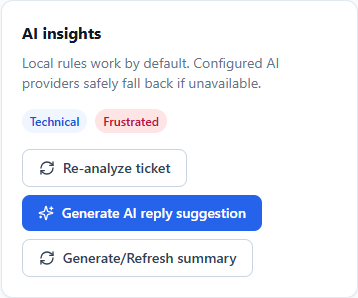

*Figure 4. AI category and sentiment shown inside the ticket workflow.*

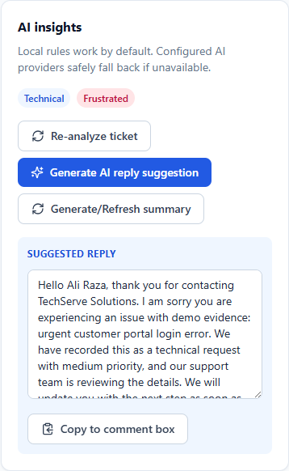

*Figure 5. Generated AI reply suggestion available to the support user.*

## 6. Messaging Integration

SMTP email was selected as the messaging platform because it provides a practical, widely supported
way to send real notifications without tying the assignment to one proprietary messaging
application. The implementation uses Python's `smtplib` module and `EmailMessage`.

Email delivery is triggered when:

- a new ticket is created;
- a ticket is escalated to Critical priority;
- a ticket is resolved.

Each message includes the ticket ID, title, customer, priority, status, category, assigned agent, and
event type. Every attempt is saved in `notification_logs`, allowing Managers and assigned Agents to
review delivery history from the ticket detail page.

### Safe Failure Handling

Messaging is deliberately fault tolerant. If messaging is disabled, the event is recorded with a
`logged` status. If configuration is incomplete, the event is `skipped`. If SMTP delivery raises an
error, the event is stored as `failed`. A delivery problem never prevents ticket creation, priority
updates, or resolution.

During the initial evidence run, the SMTP connection was attempted for ticket creation, Critical
escalation, and resolution. The configured SMTP server rejected authentication, and the application
correctly stored `failed` entries without exposing credentials or interrupting ticket work. After the
provider App Password was refreshed, the backend was restarted and a Manager test notification was
delivered successfully. The received message is shown in Figure 20.

### SMTP Setup Summary

```text
ENABLE_MESSAGING=true
MESSAGING_PLATFORM=smtp
SMTP_HOST=[SMTP server hostname]
SMTP_PORT=587
SMTP_USERNAME=[SMTP account username]
SMTP_PASSWORD=[SMTP password or provider app password]
SMTP_FROM_EMAIL=[sender email]
SMTP_TO_EMAIL=[recipient email]
SMTP_USE_TLS=true
```

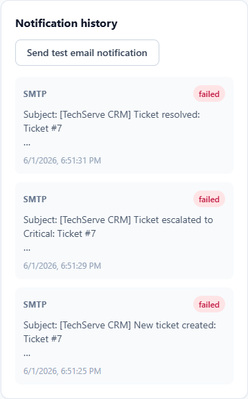

*Figure 6. Notification history showing SMTP attempt outcomes for ticket events.*

**Received email evidence:** Figure 20 shows the successfully delivered SMTP test notification.

## 7. Feature Screenshots

The following screenshots were captured from the local application using seeded demo data and a
temporary evidence ticket. The temporary ticket was removed after capture.

### Login Page


*Figure 7. Secure login screen for Manager and Agent accounts.*

### Dashboard

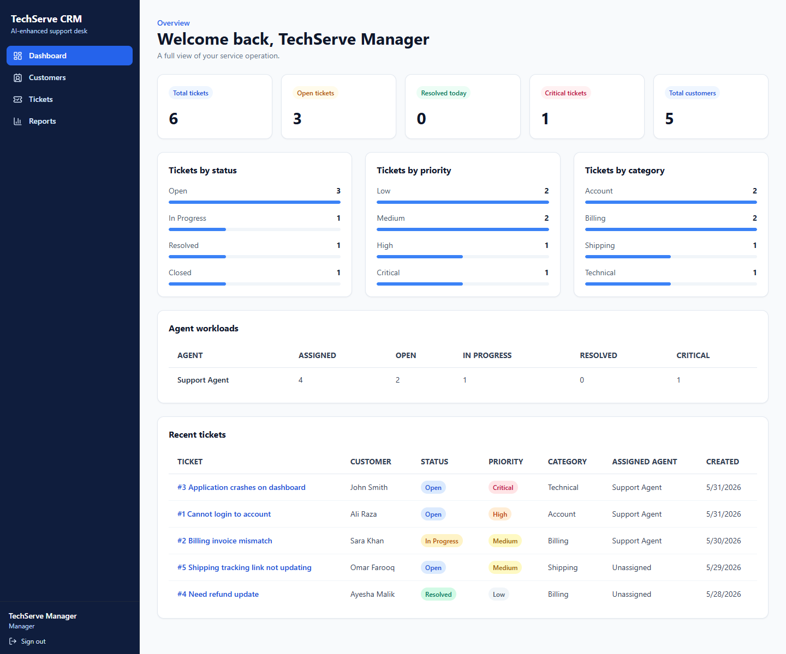

*Figure 8. Manager dashboard with ticket counts, visual indicators, workload metrics, and recent
tickets.*

### Customers List

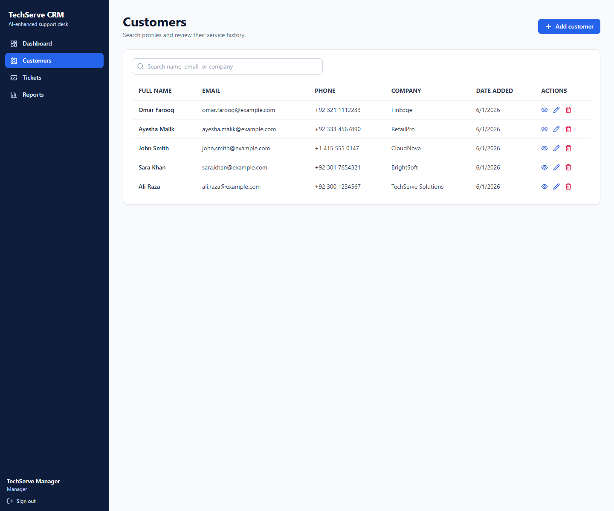

*Figure 9. Searchable customer list with contact details and actions.*

### Customer Detail

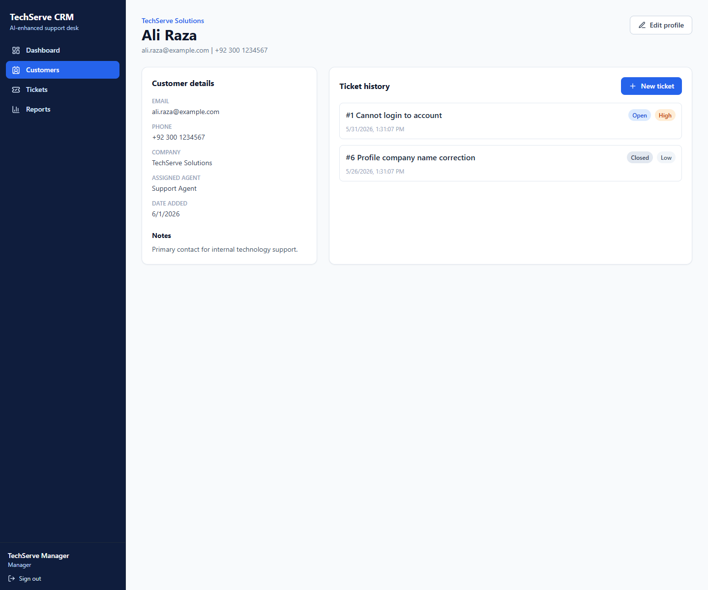

*Figure 10. Customer profile with CRM information and ticket history.*

### Tickets List

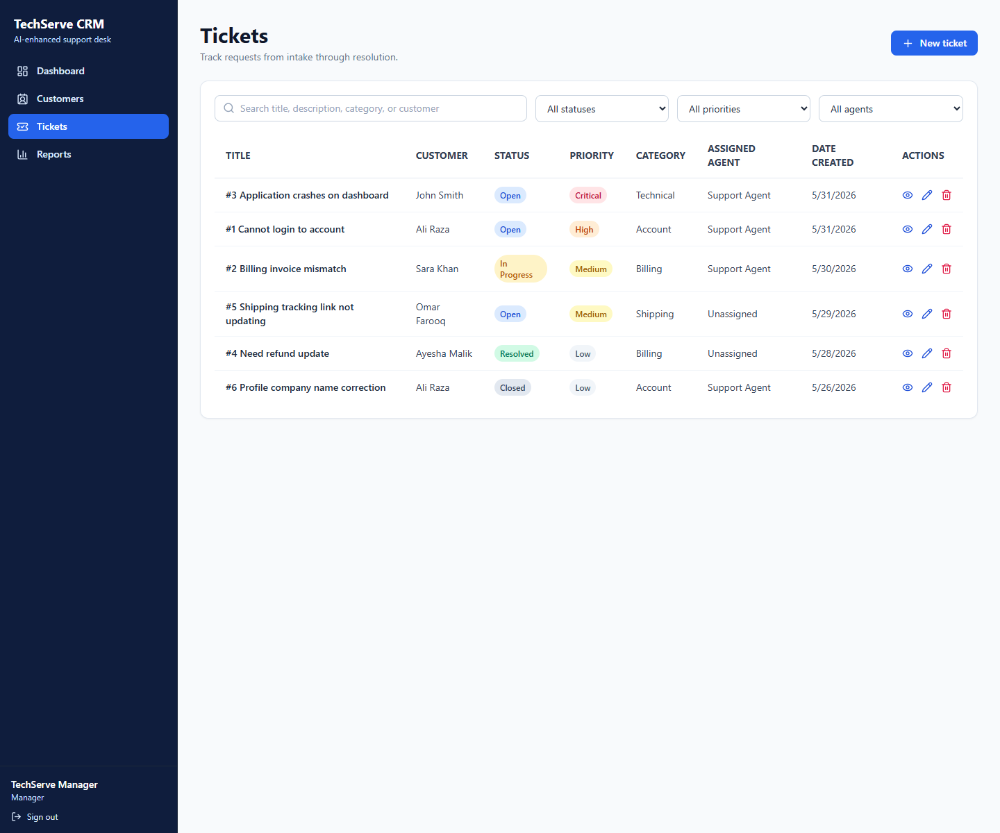

*Figure 11. Ticket list with filters, statuses, priorities, categories, and assigned agents.*

### Ticket Detail

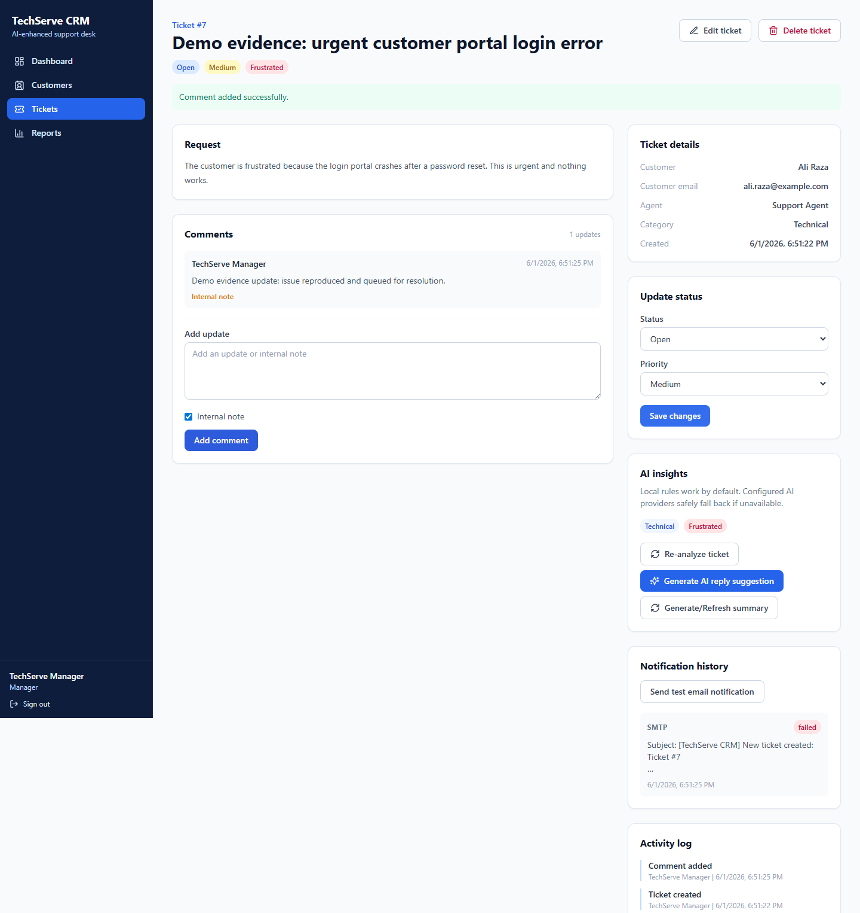

*Figure 12. Ticket detail page with request content, ownership, comments, AI tools, and history.*

### AI Insights


*Figure 13. AI categorization and sentiment analysis.*

### AI Reply Suggestion


*Figure 14. Generated customer-service reply draft.*

### Activity Log

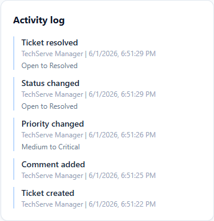

*Figure 15. Ticket activity trail with timestamps and changed values.*

### Notification History


*Figure 16. SMTP notification attempt history.*

### Reports Page

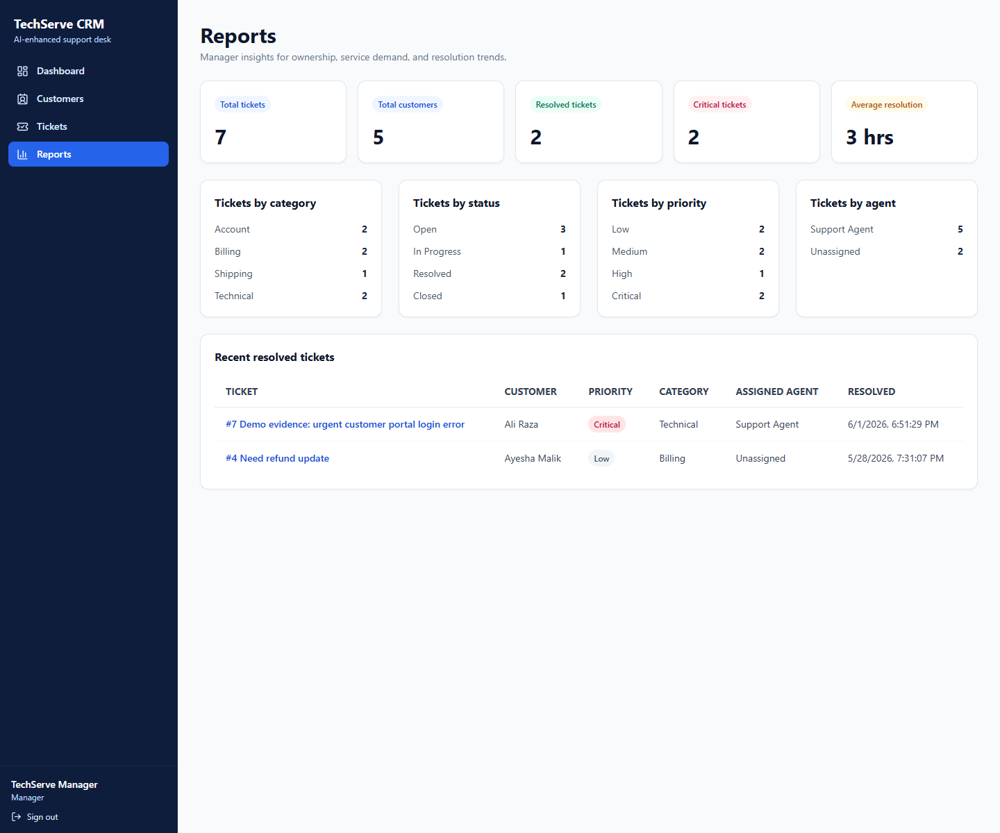

*Figure 17. Manager-only report summary.*

### Agent Dashboard And Restricted Reports Evidence

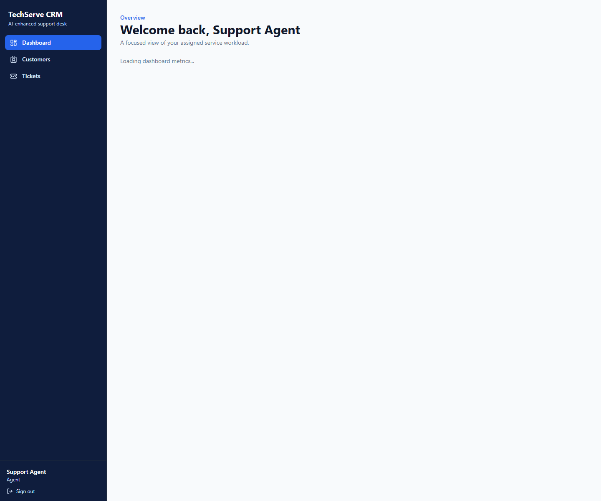

*Figure 18. Scoped Agent dashboard.*

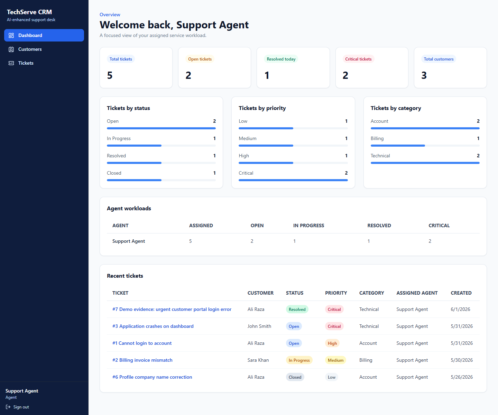

*Figure 19. Agent view after attempting to open the manager-only Reports route. The Reports link is
not shown and the application redirects to the Agent dashboard.*

### Email Notification

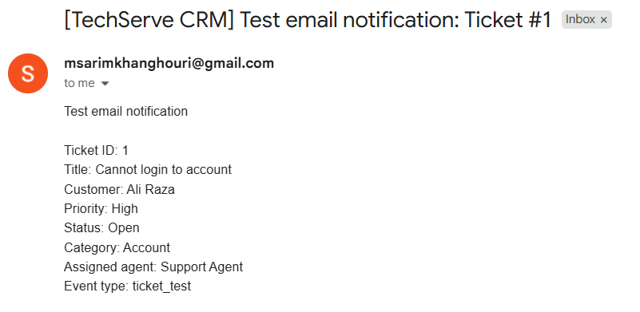

*Figure 20. Successfully delivered SMTP test notification received in the configured inbox.*

## 8. Challenges & Learnings

### Designing Role-Based Access

The application needed different experiences for Managers and Agents. Hiding a Reports link is not
enough for security, so backend dependencies also enforce permissions. Agents receive restricted
data from the API, cannot delete customers or tickets, cannot reassign tickets, and cannot access
manager reports.

### Keeping Ticket Workflows Safe

AI and messaging are useful additions, but external services can fail. The design keeps the core CRM
workflow independent from provider availability. Rule-based AI continues working without paid API
keys, and SMTP errors become persistent notification records instead of uncaught failures.

### Maintaining Database Relationships

Customers, tickets, users, comments, activity records, and notifications have connected lifecycles.
SQLAlchemy relationships keep the model readable and ensure that deleting a ticket also removes its
dependent comments, activities, and notification logs.

### Making AI Practical

The project demonstrates that AI features should support concrete user actions. Categorization,
sentiment, reply suggestions, and summaries are visible where Agents already work. The fallback
strategy also makes the project demonstrable in a local environment.

### Testing Separate User Roles

Manager and Agent workflows were tested independently. This exposed the importance of verifying
both UI behavior and direct API restrictions. A professional support system must remain secure even
when someone bypasses the frontend and calls backend routes directly.

### Protecting Configuration

Secrets belong in ignored `.env` files, not source code or screenshots. The repository uses example
environment files with placeholders. SMTP evidence is captured through application status history
without exposing usernames, passwords, tokens, or unrelated inbox content.

## 9. Work Division

Complete this table before submission. Do not remove rows that are required by the course template.

| Name | Student ID | Contribution |
| --- | --- | --- |
| [Fill in name] | [Fill in student ID] | Planning and design |
| [Fill in name or mark as individual] | [Fill in student ID] | Backend development |
| [Fill in name or mark as individual] | [Fill in student ID] | Frontend development |
| [Fill in name or mark as individual] | [Fill in student ID] | AI integration |
| [Fill in name or mark as individual] | [Fill in student ID] | Messaging integration |
| [Fill in name or mark as individual] | [Fill in student ID] | Testing and documentation |

If this is an individual submission, replace the table with:

> This project was completed individually. The work included planning and design, backend
> development, frontend development, AI integration, messaging integration, testing, and
> documentation.

## 10. References

1. FastAPI. *FastAPI Documentation*. https://fastapi.tiangolo.com/
2. React. *React Documentation*. https://react.dev/
3. Vite. *Vite Guide*. https://vite.dev/guide/
4. Tailwind CSS. *Tailwind CSS Documentation*. https://tailwindcss.com/docs
5. SQLAlchemy. *SQLAlchemy Documentation*. https://docs.sqlalchemy.org/
6. PyJWT. *PyJWT Documentation*. https://pyjwt.readthedocs.io/
7. Python Software Foundation. *smtplib - SMTP Protocol Client*. https://docs.python.org/3/library/smtplib.html
8. Python Software Foundation. *email.message.EmailMessage*. https://docs.python.org/3/library/email.message.html
9. OpenAI. *Responses API Reference*. https://platform.openai.com/docs/api-reference/responses
10. Google. *Gemini API GenerateContent Documentation*. https://ai.google.dev/api/generate-content
11. Pydantic. *Pydantic Documentation*. https://docs.pydantic.dev/
12. Axios. *Axios Documentation*. https://axios-http.com/docs/intro
13. React Router. *React Router Documentation*. https://reactrouter.com/
